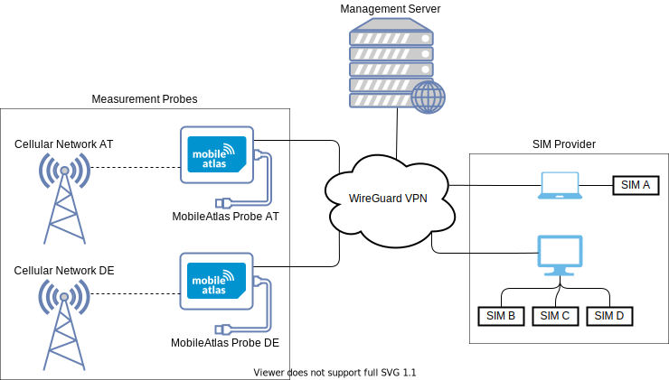
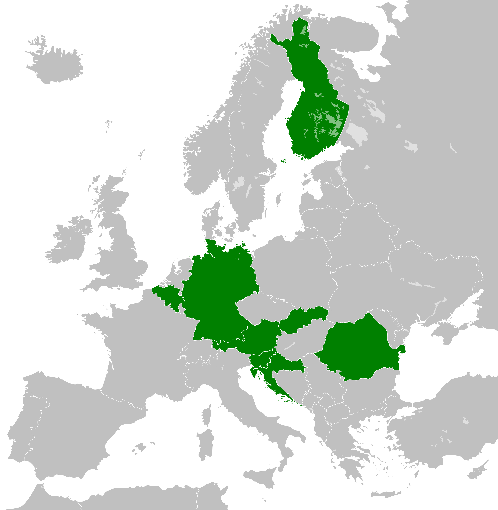

  

  A Scalable Way to Measure Cellular Networks

MobileAtlas
============

MobileAtlas is a scalable, cost-efficient test framework for cellular networks that takes international roaming measurements to the next level. 
It implements the promising approach to geographically decouple SIM card and modem, which boosts the scalability and flexibility of the measurement platform. It offers versatile capabilities and a controlled environment that makes a good foundation for qualitative measurements. 
Further information can be found on our [website](https://www.mobileatlas.eu/).

### Repository Directories (with README Files)
* root directory (this file): project overview and introduction of the most relevant framework components
* [mobileatlas](/mobileatlas): mobileatlas python modules
* [hardware](/hardware): hardware specification and SIM tunneling technique
* [setup](/setup): setup scripts that are used to install the MobileAtlas framework on a dedicated Raspberry Pi device
* [probe-statuspage](/setup/systemd/probe-statuspage/doc/): documentation of lightweight status page that is running locally on the probes

### Related Repositories
* [mobile-atlas-management](https://github.com/sbaresearch/mobile-atlas-management): management dashboard for admin interactions with deployed probes
* [pySIM](https://github.com/GGegenhuber/pysim): forked version of pySIM that is used by SIM provider and measurement probe
* [masters-thesis](https://github.com/GGegenhuber/masters-thesis): thesis that utilized mobile-atlas to measure traffic classification and zero-rating 
* [wehe-server](https://github.com/phfrenzel/wehe-server): wehe-server that was extended (support for multiple traffic streams, IPv6) and is used for measurements on the MobileAtlas platform
* [wehe-client](https://github.com/phfrenzel/wehe-cmdline): counterpart to the adapted wehe-server; to be used within MobileAtlas the wehe client and pre-recorded traffic recordings are placed within the probe's [measurement implementation](mobileatlas/probe/measurement/payload/res/wehe)

### Publications
* [[GLOBECOM22] Zero-Rating, One Big Mess: Analyzing Differential Pricing Practices of European MNOs](https://www.mobileatlas.eu/papers/22_GLOBECOM_Zero_Rating_One_Big_Mess.pdf)
* [[USENIX Security '23] MobileAtlas: Geographically Decoupled Measurements in Cellular Networks for Security and Privacy Research](https://mobileatlas.eu/papers/23_USENIX_SECURITY_MobileAtlas_Geographically_Decoupled_Measurements_in_Cellular_Networks.pdf)

### Geographical Decoupling of SIM Card and Modem
Physically moving devices and SIM cards between countries to enable measurements in a roaming environment is costly and does not scale well.
Therefore, we introduce an approach to geographically detach the SIM card from the modem by tunneling the SIM card's protocol over the Internet and emulating its signal on the LTE modem.
This allows us to test roaming effects on a large number of operators without physically moving any hardware between different countries.
More specific details regarding the technical implementation of the SIM tunneling technique can be found in the [README file](/hardware#sim-tunneling) of the hardware directory.

### Framework Architecture
The framework can be structured into three main components: SIM providers that allow sharing SIM card access, measurement probes that act as a local breakout to the cellular network, and a management server that connects the prior two components and acts as command and control unit for the measurement probes.

    

#### SIM Provider
The SIM provider is used to remotely make one or more SIM cards available to the measurement platform.
For communication between the computer and the SIM card, we rely on a [modified version of pySim](https://github.com/GGegenhuber/pysim).
The python file that implements the SIM provider is [sim.py](/sim.py) and uses the [simprovider](/mobileatlas/simprovider) python module (virtualenv required).
More specific details regarding the hardware requirements can be found in the [README file](/hardware#sim-provider) of the hardware directory.

#### Measurement Probe
MobileAtlas probes are responsible for measurement execution.
Each probe consists of a single-board computer with at least an Internet uplink, USB host support, and a GPIO interface.
The python file that is used for test execution on a measurement probe is [probe.py](/probe.py) and uses the [probe](/mobileatlas/probe) python module (virtualenv required).
A detailed breakdown of all used hardware components can be found in the in the [README file](/hardware#measurement-probe) of the hardware directory.

##### Measurement Probe Deployment During Current Fieldtest
MobileAtlas is currently deployed in eight European countries: Austria, Belgium, Croatia, Finland, Germany, Romania, Slovakia, and Slovenia.
Although our focus lies on countries within the EU we also have measurement probes in two American countries: Canada and USA.

    

We are looking for early adopters, who share interest in the topic and like to contribute to the success of MobileAtlas.
Right now, we need people (or organizations, universities, research institutes, etc.) that host measurement probes. 
Further information can be found on our [website](https://www.mobileatlas.eu/).

Acknowledgments
---------------------------------------
MobileAtlas was developed at [SBA Research](https://www.sba-research.org/) and [University of Vienna](https://sec.cs.univie.ac.at/) by 
[Gabriel K. Gegenhuber](https://www.sba-research.org/team/gabriel-k-gegenhuber/),
[Wilfried Mayer](https://www.sba-research.org/team/wilfried-mayer/),
[Adrian Dabrowski](https://www.sba-research.org/team/adrian-dabrowski/), and
[Philipp Frenzel](https://www.sba-research.org/team/philipp-frenzel/).

Additionally, thanks go to [Markus Maier](https://www.sba-research.org/team/markus-maier/) for his occasional advice and his help designing the [SIM PCB](/hardware/sim-adapter).

Furthermore, we want to thank all hosters of measurement probes who made this work possible at all.

### Funding
This project was funded through the [NGI0 Entrust](https://nlnet.nl/entrust) Fund, a fund established by [NLnet](https://nlnet.nl/) with financial support from the European Commission's [Next Generation Internet](https://ngi.eu/), under the aegis of DG Communications Networks, Content and Technology under grant agreement No 101069594.

This project was funded through the [NGI0 PET](https://nlnet.nl/PET) Fund, a fund established by [NLnet](https://nlnet.nl/) with financial support from the European Commission's [Next Generation Internet](https://ngi.eu/) programme, under the aegis of DG Communications Networks, Content and Technology under grant agreement No 825310.

This research was also funded by the Austrian Science Fund (FWF): P30637-N31.

### Image credits

[Blank map of Europe](https://commons.wikimedia.org/wiki/File:Blank_map_of_Europe_cropped.svg), licensed under [Creative Commons Attribution-ShareAlike 3.0 Unported](https://creativecommons.org/licenses/by-sa/3.0/deed.en)

License
---------------------------------------

MobileAtlas is licensed under GPLv3

