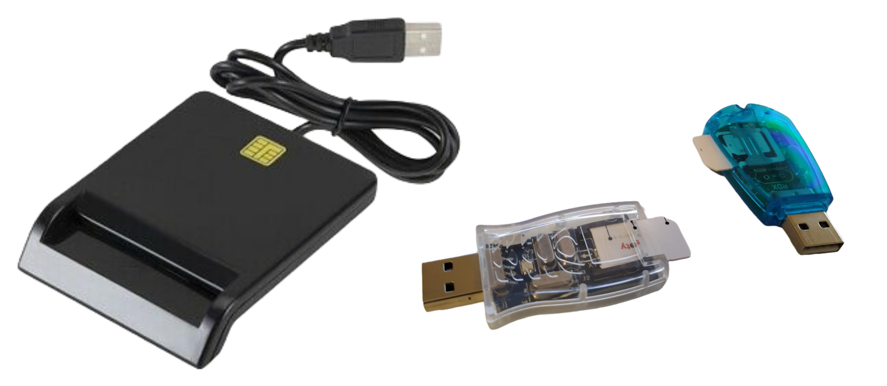
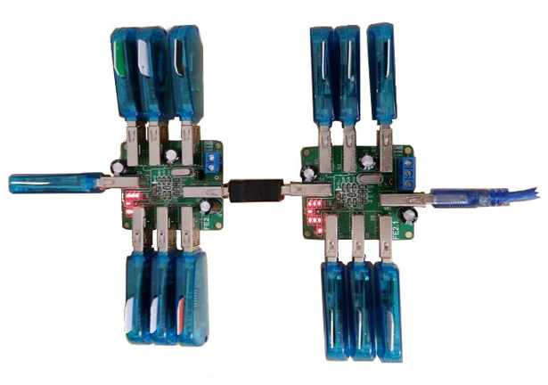
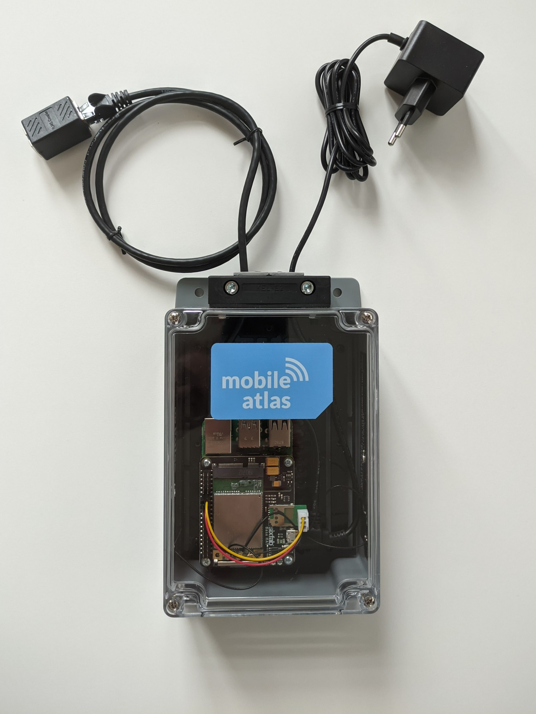
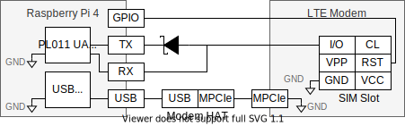
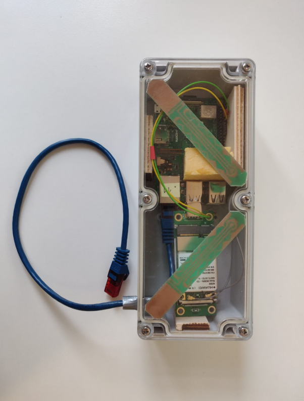

MobileAtlas Hardware
============
Although the project is designed to be flexible in terms of support for different hardware components, we give an overview of the hardware that we currently use for the different framework components.

SIM Provider
============
The SIM provider is used to remotely make one or more SIM cards available to the measurement platform.
For communication between the computer and the SIM card, we rely on a [modified version of pySim](https://github.com/GGegenhuber/pysim).
Therefore, the user can choose between several options (e.g., PC/SC reader, Serial-based SIM card reader, Bluetooth rSAP, etc.) to connect the SIM card to the system.

    

Due to high realibility and low phyiscal SIM card abrasion when switching between cards, we mainly rely on the PC/SC reader variant for our scientific studies.
We used [this](https://www.amazon.de/dp/B077BXBN6Y/) SIM reader, but any other PC/SC compliant reader should work equally well.

Other than that, we've tested two different variants of Serial-based SIM card readers. The transparent variant (used in 3.579 MHz mode, while also offering 7.2 MHz via hardware switch) worked well for all tested SIM cards. However, we've experienced minor issues with serveral SIM cards when initiating communication with the blue variant (that only offers the 3.579 MHz frequency). Sometimes replugging the SIM reader resolved the issue. Still, for many SIM cards the blue variant worked without issues.
   
Our Bluetooth rSAP implementation is experimental and often Android phones do not offer the required Bluetooth service.
However, we were able to successfully use it with an Nexus 5X.

To support a big amount of SIM cards and operators without any physical intervention (similar to SIM banks for VoIP gateways) in a cost-efficiant way we've built and tested an array of Serial-based SIM readers that are plugged into USB hubs.

    

Although the USB standard theoretically allows for up to 127 connected devices, we've experienced troubles with multiple hosts (e.g. enumeration failure, USB driver errors) when chaining multiple USB hubs and connecting an unusually high amount of devices to the USB bus.
Therefore we've tested various USB hubs for our purpose. USB hubs that use an FE 2.1. controller turned out to be the most reliable ones.
Furthermore, we've noticed that the used host device also has an impact on the reliability of the overall solution (e.g. a Raspberry Pi was less reliable, compared to a commodity laptop computer).
Finally, we were able to successfully test our SIM provider for up to 32 concurrently attached SIM cards via one USB host.

Measurement Probe
============
### Probe Version 1.0 (current)

    

### Used Hardware Components
| Component | Model | Cost |
| --- | --- | ---: |
| Single-Board Computer | [Raspberry Pi 4 Model B, 4GB RAM](https://www.raspberrypi.com/products/raspberry-pi-4-model-b/) | 60€ |
| Power Supply | [Official Raspberry Pi Power Supply](https://www.raspberrypi.com/products/type-c-power-supply/) | 10€ |
| SD Card | Samsung EVO Plus 128GB (MB-MC128GA/EU) | 15€ |
| Modem | [Quectel EG25-G (mPCIe)](https://sixfab.com/product/quectel-ec25-mini-pcie-4g-lte-module/) | 75€ |
| Modem Adapter | [Sixfab Raspberry Pi LTE Base HAT](https://sixfab.com/product/raspberry-pi-base-hat-3g-4g-lte-minipcie-cards/) | 44€ |
| Antenna | [Pulse W6113B0100](https://sixfab.com/product/lte-main-diversity-gnss-triple-port-u-fl-antenna-100mm/) | 10€ |
| Case | [Sixfab Raspberry Pi IP54 Case](https://sixfab.com/product/raspberry-pi-ip54-outdoor-iot-project-enclosure/) | 80€ |
| SIM Adapter | [Selfmade SIM PCB](sim-adapter/) | 2€ |
| Misc | Network Cable, Wires, etc. | 3€ |

Further remarks regarding hardware components:

* We've used the Raspberry Pi 4 Model B with 4GB RAM due to good availability and widely usage. However, the 2GB/8GB version should also work without any modifications.
Earlier Raspberry Pi versions should work as well, although minor modifications in source code could be neccessary (e.g., to correctly configure the UART that is used to tunnel the SIM connection).  
* We've tested and optimized MobileAtlas to work with the Quectel EG25 modem. Supporting other modems should be easily possible, because we use ModemManager to communicate with the attached modem. Although ModemManager does a good job offering basic functionalities for a broad set of modems, some modems work better than others. Furthermore, several modem-specific parameters (e.g., the CLK frequency of the modem's SIM interface) need to be adjusted in the source code.
* The current MiniPCIe HAT offers powering up/down of the attached modem by setting specific GPIO ports to high/low. When using another modem adapter this functionality needs to be patched accordingly (e.g., by using a USB-based power-cycle or AT commands).

### SIM Tunneling
We use the Raspberry Pi's PL011 UART interface in combination with a simple adapter circuitry, to communicate with the modem and emulate the SIM card on the mPCIe modem HAT adapter.

    

The communication between SIM card and modem is standardized by the ISO-7816 T=0 link protocol, as well as the ISO 7816-4 Application Protocol Data Unit (APDU) application protocol.
The protocol is byte-oriented, and timing constraints are not very strict, which makes it easy to relay.

The SIM card usually receives a clock signal from the modem that is used as a baseline for sending bytes between SIM card and modem. Although the protocol specification allows varying clock speeds (e.g., slow down during idle time), usual modems just provide a fixed clock frequency and do not change it during operation.
Therefore, we've measured the modem's CLK frequency with an oscilloscope and configure the baudrate of our UART interface accordingly.
To make the SIM's I/O pin compatible with the Raspberry Pi's UART we add a Schottky diode between RX and TX (which converts it to an open-collector output). A
pull-up resistor is already provided by the modem.

Furthermore, we've connected a GPIO port to the RST pin of the modem to reliably detect when the modem is resetting the SIM card.
When a reset is detected, we send an Answer To Reset (ATR) message to initiate communication with the modem.

After a successful connection setup, we just relay all APDUs that are received from the modem to our SIM provider.
For expensive commands or long-lasting round-trip times, we can repeatedly signal Waitng Time eXtension (WTX) to the modem.

Historical Builds
-----------
During early experiments we've used even cheaper hardware for our measurement probes.  
The first prototype was based on a Raspberry Pi 3B+ and a Huawei ME909s-120 modem.  
To connect the modem to the system, we've used a cheap [Mini PCIe to USB Adapter](https://www.aliexpress.com/item/33059509853.html) from Aliexpress. Since pins of the SIM card socket are exposed and easily accessible we directly soldered wires to the pins instead of using an elegant adapter PCB.
Althouth the early prototype was working as expected, we experienced some stability issues (e.g., dead mPCIe adapters, disconnected wires) during long lasting remote deployment scenarios. Therefore, we switched to more professional components in the succeeding revision. 

### Early Probe Prototype

    

### Candidate Components for 5G-ready Probe Version (testing)
| Component | Model | Cost |
| --- | --- | ---: |
| Single-Board Computer | [Raspberry Pi 4 Model B, 8GB RAM](https://www.raspberrypi.com/products/raspberry-pi-4-model-b/) | 100€ |
| Power Supply | [Official Raspberry Pi Power Supply](https://www.raspberrypi.com/products/type-c-power-supply/) | 10€ |
| SD Card | Samsung EVO Plus 512GB (MB-MC512GA/EU) | 80€ |
| Modem | [Quectel RM500Q (M.2)](https://www.quectel.com/wp-content/uploads/2021/03/Quectel_RM500Q-AE_5G_Specification_V1.1.pdf) | 500€ |
| Modem Adapter | [Sixfab Raspberry Pi 5G Development Kit (including Case, Antennas)](https://sixfab.com/product/raspberry-pi-5g-development-kit-5g-hat/) | 210€ |
| SIM Adapter | [Selfmade SIM PCB](sim-adapter/) | 2€ |
| Misc | Network Cable, Wires, etc. | 3€ |

Further remarks:
We're currently building a 5G-ready prototype with the listed components. Supporting other modems should be easily possible, because we use ModemManager as an abstraction layer to communicate with the attached modem. Similarily, other 5G HATs (e.g., [SIM8200EA-M2 5G HAT](https://www.waveshare.com/wiki/SIM8200EA-M2_5G_HAT)) should work equally well, since the modem is actually just attached via USB. However, we currently use HAT-specific GPIO ports to send out-of-band control messages to the modem (e.g., powering up/down via pulling a specific pin to high/low). Using a different HAT therefore requires minor patches to correctly map this to the corresponding GPIO pins.