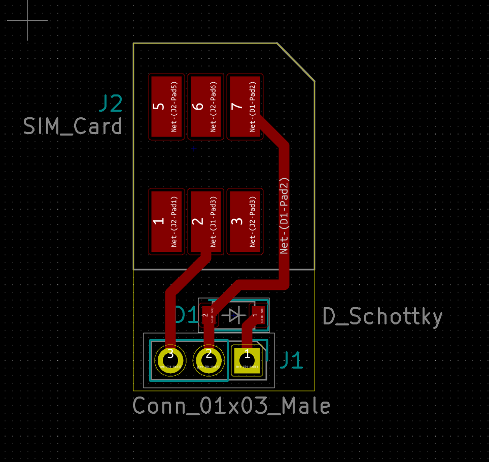
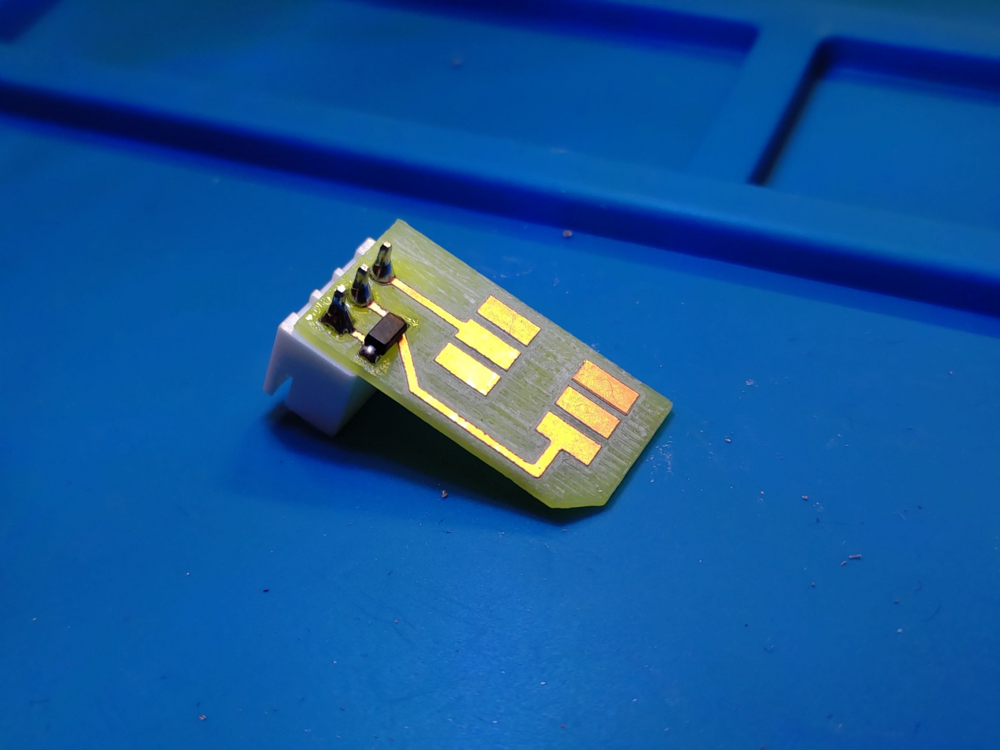
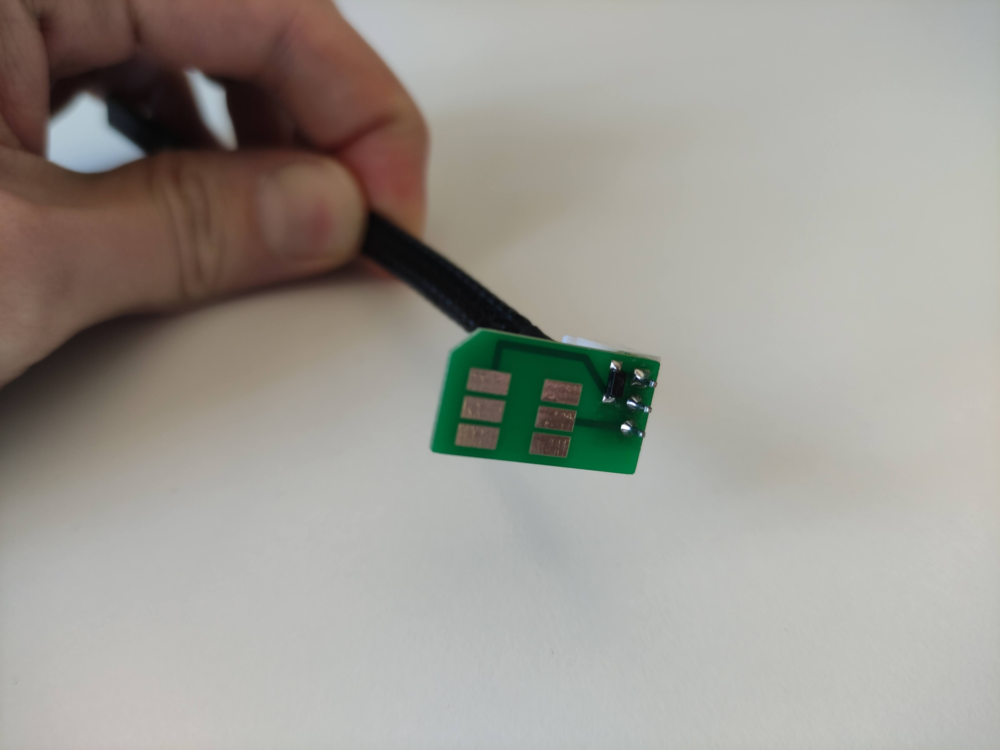

# Mobile Atlas SIM Card Adapter

The PCB is designed to be inserted into the (micro) SIM card socket of the [Sixfab Raspberry Pi LTE Base HAT](https://sixfab.com/product/raspberry-pi-base-hat-3g-4g-lte-minipcie-cards/).  
It attaches to the RST and IO pin of the SIM card that are required for APDU tunneling.  
To make the IO pin compatible with the Raspberry's UART we add a Schottky diode between RX and TX.  

PCB Preview
-----------

Prototype (selfmade CNC)
-----------

Prototype (via JLCPCB)
-----------

Credits
-----------
Thanks to [Markus Maier](https://www.sba-research.org/team/markus-maier/) for designing the PCB.
